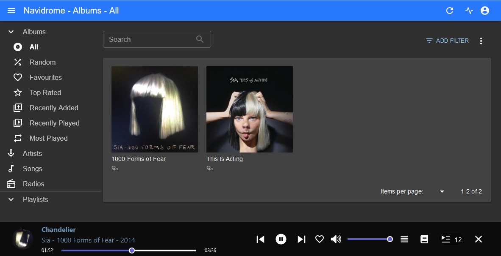

**Endpoint**: I now have a household music streaming server with [native apps on android and iphone](https://substreamerapp.com/), a web client and [desktop client](https://github.com/dweymouth/supersonic). I could put it on the internet to use when I'm out and about if I wanted to. Very cool! In my browser it looks like this:



**Longer:** I've been interested in setting my own streaming servers up for years. I've given Plex a go as a video server but its creeping commercialism kept me from going all-in so [Jellyfin](https://jellyfin.org/) has been tempting me but I don't have a PC that could do the necessary video transcoding lying around that I yet want to leave turned on 24/7.

So [this article on setting up the music streaming server Navidrome, by Wouter Groeneveld](https://brainbaking.com/post/2022/03/how-to-stream-your-own-music-reprise/), was verrrrrry interesting and I thought I'd give it a go - successfully as it turns out!

I have got a box of unused raspberry pis at home, so pulled out the first one and started the setup. Turns out that I am now running Navidrome on an [original Raspberry Pi Zero W](https://www.raspberrypi.com/products/raspberry-pi-zero-w/) with a whopping single 1GHz core and 512MB RAM.

Broadly, [these were the instructions I followed](https://www.makeuseof.com/raspberry-pi-navidrome-self-hosted-music-server/) but with a few modifications along the way which I've put below.

## 1. Install docker

```bash
curl -sSL https://get.docker.com | sh
sudo usermod -aG docker $USER
sudo apt-get install uidmap
dockerd-rootless-setuptool.sh install
```

## 2. Set up Navidrome

1. create directories
	1. `mkdir navidrome navidrome/data`
	2. `mkdir music`
2. copy music across from your local PC. I just did a couple of albums to make sure it was all working OK (I had to make sure I wasn't using the version of scp which is bundled with windows so I used C:\Program Files\Git\usr\bin\scp.exe)
	1. `scp -r Sia/* pi@your-pi-local-ip-address:~/music/`
3. create `docker-compose.yml` based on https://www.navidrome.org/docs/installation/docker/:
```yaml
services:
  navidrome:
    image: deluan/navidrome:latest
    ports:
      - "4533:4533"
    restart: unless-stopped
    environment:
      # Optional: put your config options customization here. Examples:
      ND_SCANSCHEDULE: 1h
      ND_LOGLEVEL: info
      ND_SESSIONTIMEOUT: 24h
      ND_BASEURL: ""
    volumes:
      - "/home/pi/navidrome/data:/data"
      - "/home/pi/music:/music:ro"
```

## 3. Run docker-compose

`docker-compose up -d`

To check its status: `docker ps`
To check the logs: `docker logs <container id>`

## Use Navidrome!

4. Visit http://raspberrypi:4533 in your browser
5. Fill the username and password for an admin user
6. Play music!

If that is all working then:
7. Create a second non-admin user
8. Install substreamer: https://substreamerapp.com/
9. Log in and stream your music on your phone!

Great success!